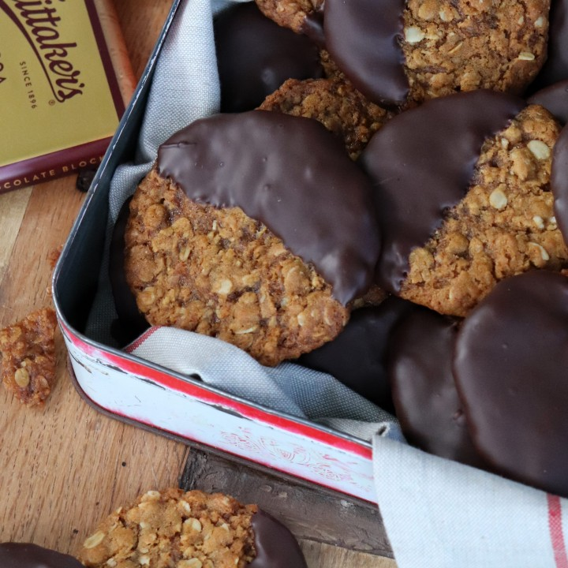

# ANZAC Biscuit

An [oatmeal cookie](https://en.wikipedia.org/wiki/Anzac_biscuit) celebrating the Australian & New Zealand Army Corps. Adapted from [here](https://www.whittakers.co.nz/en_WW/recipes/chocolate-anzac-biscuits/).

## Ingredients

| Ingredient | Quantity | Notes |
| ---------- | -------- | ----- |
| Rolled Oats | 1 Cup |
| Flour | 1 Cup | all purpose |
| Desiccated Coconut | 1 Cup | or flaked coconut |
| Brown Sugar | 1 Cup | |
| Golden Syrup | 1/4 Cup | see [recipe](./golden_syrup.MD) or found in specialty/English baking stores |
| Butter | 125 g | weighted |
| Boiling Water | 2 Tbsp | |
| Baking Soda | 1/2 Tsp | |
| 50% + Dark Chocolate | 250 g | block/cooking chocolate |

## Preparation

### Step 1
1. Preheat oven to 160°C / 325°F.
2. Line two oven trays with baking/parchment paper.

### Step 2
1. Combine rolled oats, flour, coconut and sugar in a bowl.
2. Heat together butter, golden syrup and water in a small saucepan until butter melts. Stir in baking soda.
3. Mix into dry ingredients until well combined.

### Step 3
1. Roll mixture into small balls (approx. 20) and place on trays.
    * Allow sufficient room between each for spreading.
2. Flatten each ball slightly with a fork
3. bake for 15 minutes (for a chewy biscuit) or 20 minutes for a crunchier biscuit.
4. Allow to cool on the trays for 5 mins before transferring to a wire rack to cool completely.
    * Note, this will cause the cookie to cook further so use best judgement.

### Step 4
1. Melt a block of Dark Chocolate in a small bowl using a double boiler technique.
2. When biscuit is cool, dip half of each biscuit in chocolate and place on a wire rack until set.
3. Keep in an airtight container for up to a week.

## Iterations