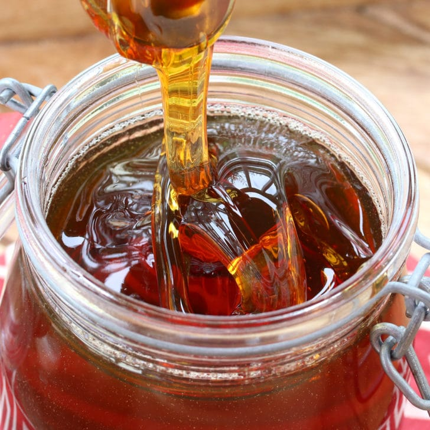

# ANZAC Biscuit

Pulled from [here](https://www.daringgourmet.com/how-to-make-golden-syrup/).

No need to rush to the store or special order your Golden Syrup. With just 3 ingredients you can make your own. It's easy, is 99% hands off, and your syrup will keep for months!

## Ingredients

| Ingredient | Quantity | Notes |
| ---------- | -------- | ----- |
| water | 1 1/4 cups (300 ml) | |
| cane sugar | 4 cups (800 g) | for a deeper flavor you can substitute a little bit of brown sugar if desired but will need to use a digital thermometer *see note. |
| lemon juice | 2 tablespoons | fresh or bottled |

## Prepration

### Step 1
1. Place the sugar and water in a saucepan and stir to combine.
2. Bring it to a boil, stirring regularly to prevent burning until the sugar is dissolved.
    * Stir very gently to prevent sugar water from splashing up the sides of the saucepan.
3. Once boiling gently stir in the lemon juice.
4. Reduce the heat to a very low and gentle simmer. Leave the saucepan uncovered.
5. **DO NOT STIR** the syrup again.
6. Let it simmer on very low for 40-60 minutes or longer until the sugar is a rich amber color.
    * If you're using a thermometer the temperature should be about 240-250 degrees F.
    * If your syrup is too thick and stiff you can reheat it, adding a little bit of water.
    * If your syrup is too runny then you need to let the syrup caramelize longer.
7. Turn off the heat, let it sit for a few minutes, then pour the hot syrup into a glass jar.
8. Let it cool completely before closing the jar with tight sealing lid.
9. Store your golden syrup at room temperature where it will keep for several months.

This makes approximately 3 cups of golden syrup.

## Notes

If your using substituting a little brown sugar it will make it difficult to judge the "doneness" of the syrup based on appearance; using a digital thermometer is recommended.