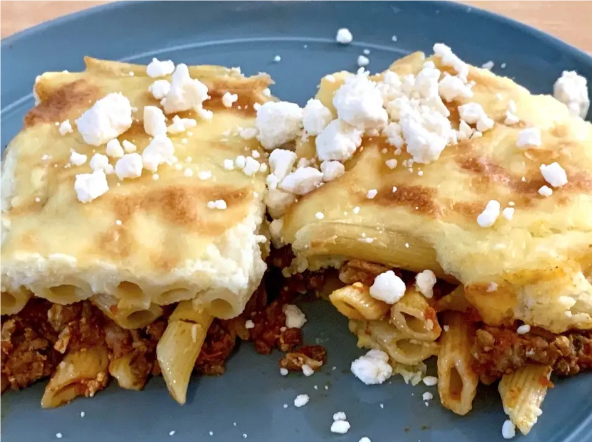

# Greek Lasanga

Replicated from [here](https://www.insider.com/classic-greek-pasta-dish-thats-better-than-lasagna-2021-6) (which has nice progress pictures).

## Ingredients

| Ingredient | Quantity | Notes |
| ---------- | -------- | ----- |
| penne pasta | 1 box |  pastitsio or bucatini noodles are preferred. or look for spaghetti-like paste with a large diameter |
| ground beef | 1 pound | |
| egg | 3 | |
| marinara sauce | 1/2+ jar | seems to always need more sauce |
| butter | 1 & 1/2 sticks | |
| onion | 1/2 | |
| milk | 2 cups | |
| flour | 1/4 cup | |
| parsley | bunch | |
| feta | | optional, garnish |

## Preparation

### Step 1
1. Roughly chop onion and parsley
2. Brush baking dish with oil

### Step 2
1. Prepare the pasta.
    1. Bring large pot of salted water to boil.
    2. Cook pasta.
    3. Drain.
    4. [Optional] Melt 1/2 stick of butter in pot and toss pasta.
2. Prepare the sauce.
    1.Heat pan over medium heat.
    2. Add olive oil and onions. Cook until translucent.
    3. Add ground meat, salt, and parsley. Break apart meat. Cook until browned.
    4. Crack egg over mixture. Mix together until egg is fully cooked.
    5. Add sauce and mix.
    6. Cook for a few minutes then turn off heat.
3. Prepare the baking dish.
    1. Cover the bottom with a layer of cooked pasta.
    2. Add the second layer of meat/sauce.
    3. Add a third layer of cooked pasta.
    4. Preheat oven to 350 degrees.
4. Prepare the béchamel sauce.
    1. Lightly beat 2 eggs in bowl.
    2. In small saucepan, melt 1 stick of butter.
    3. Turn up heat to medium-high.
    3. In small portions, add the milk and flour while continuously mixing.
    4. Once the sauce starts to thicken, add the beaten eggs. Continue stirring.
    5. As soon as it starts to come to a boil, remove from stove.
    6. Immediately layer on baking dish.
5. Bake
    1. Bake at 350 degrees for about 30 minutes. Top layer will brown in spots.