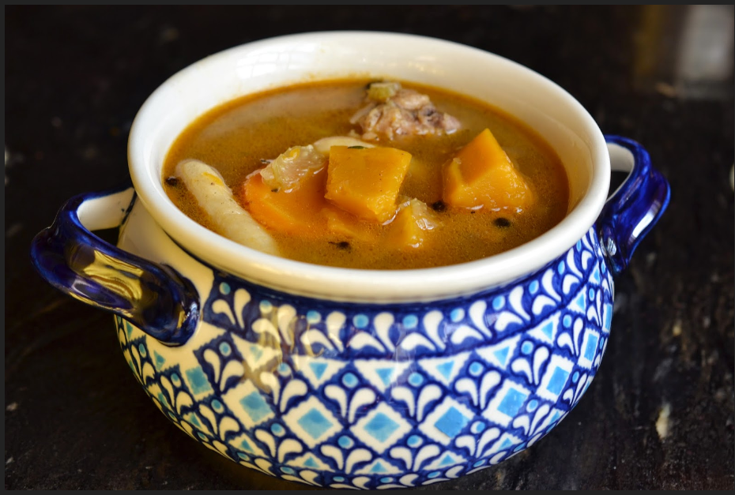

# Jamaican Chicken Soup

Traditional recipes call for corn.

## Ingredients

| Ingredient | Quantity | Notes |
| ---------- | -------- | ----- |
| chicken | 1 lb | e.g. breast |
| tomatoes | 8 oz can | diced, drained |
| fresh butternut squash or pumpkin | 1 | |
| onion | 1 yellow | |
| celery | 2 stalks | |
| carrots | 3-6 | long, not baby |
| garlic | 2-3 cloves | |
| parsley | bunch | |
| dill weed | 1 tbsp | |
| red hot peppers | 2 dried | or substitude chili pepper flakes |
| pasta | 1 box | bow tie |
| cheese | to garnish | sharp flavor such as Parmesan or Dubliner |

## Preparation

### Step 1
1. Slice the following vegetables.
    * Carrots
    * Celery
    * onion
2. Peel, seed, and cube the squash/pumpkin.
3. Wash chicken in lime juice and water.

### Step 2
1. Bring water to boil
2. Add chicken with salt, dill, garlic, parsley. Cook for ~10 minutes.
3. Add the tomatoes, squash/pumpkin, onion, celery, carrots, peppers.
4. Reduce heat to simmer and cook for ~3 hours.

### Step 3
1. In separate pot, bring water to boil.
2. Cook pasta.
3. Drain.

### Step 4
1. Place noodles in bowl.
2. Add soup and broth.
3. Grate cheese over top.