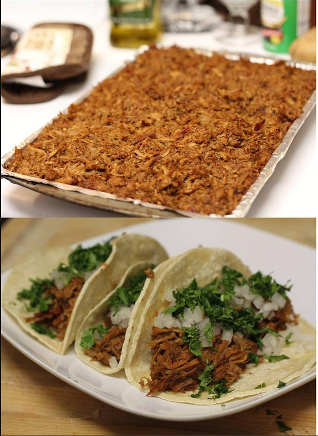

# Pork Carnitas

[From an old friend.](https://i.imgur.com/dxwRT.jpg) (nice progress pictures).

## Ingredients

| Ingredient | Quantity | Notes |
| ---------- | -------- | ----- |
| boneless pork butt | 4-6 lbs | check the local butcher |
| onion | 1 large | |
| garlic | 4 cloves | |
| cumin | 1 tbsp | |
| coriander | 1 tbsp | |
| oregano | 1 tbsp | |
| chipotles en adobo | 5-6 | |
| bay leaves | 2 | |
| chicken broth | 2 quarts | |
| salt | 1 tbsp | |
| oil | 2-3 tbsp | |

## Preparation

### Step 1
1. Cut onions into large chunks.
2. Cut/mash garlic.
3. Cut pork into 2 in chunks.

### Step 2
1. Add the following into large stock pot.
    * pork
    * onion
    * garlic
    * coriander
    * oregano
    * cumin
    * bay leaves
    * salt
    * adobos + sauce
    * stock
2. Add water to cover ingredients if needed.
3. Bring to boil.
4. Immediately, reduce to slow simmer.
5. Cook uncovered for ~3 hours or until most liquid is gone.

### Step 3
1. Preheat oven to 400 degrees F.
2. Shred meat as needed.
3. Drizzle oil over meat. Toss.
4. Spread meat over baking sheets.
5. Roast for 10 - 15 minutes or until meat becomes a little crispy.