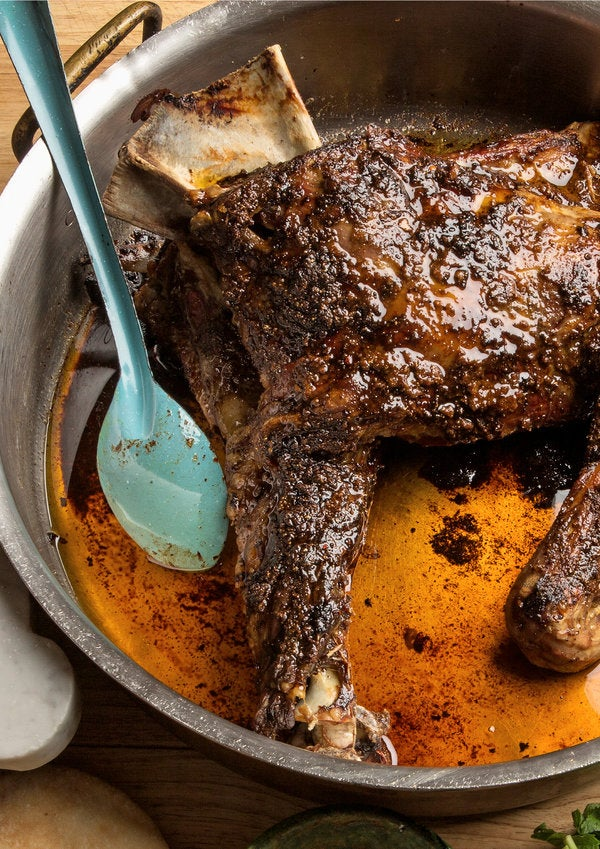

# Moroccan Lamb
Recommended by a friend, inspired from [NY Times](https://cooking.nytimes.com/recipes/1016562-almost-spit-roasted-moroccan-lamb).

## Ingredients
* lamb
    * 1 front quarter of lamb ~10-12 pounds, or
    * two ~5-6 pound lamb shoulder roasts
* Salt
* 6 oz unsalted butter, softened
* 2 teaspoons cumin
* 2 teaspoons coriander
* 2 teaspoons paprika
* 1/2 teaspoon pimentón (optional)
* 6 garlic cloves, smashed

## Preparation
1) Step 1
    1) Trim lamb of extraneous fat, but leave a thin layer of fat covering the meat (or ask your butcher to do this).
    2) Use a sharp paring knife to cut slits all over the lamb.
    3) Lightly salt meat on both sides and place in a large roasting pan.
    4) Mix together butter, cumin, coriander, paprika, pimentón and garlic.
    5) Smear butter mixture over surface of meat.
    6) Allow meat to come to room temperature.
    7) Heat oven to 450 degrees.

2) Step 2
    1) Roast lamb, uncovered, for 30 minutes, until it shows signs of beginning to brown.
    2) Reduce heat to 350 degrees.
    3) Continue roasting for 3 to 4 hours
    4) Every 15 minutes or so, baste generously with buttery pan juices, until meat is soft and tender enough to pull away easily from bones and skin is crisp.
    5) If surface seems to be browning too quickly, tent loosely with foil and reduce heat slightly. In this case, remove foil, baste lamb and allow skin to crisp before removing from oven.

3) Step 3
    1) Transfer lamb to a large platter or cutting board and serve piping hot.
    2) Encourage guests to tear pieces of lamb with fingers; alternatively, carve meat from bones and chop into rough pieces.
    3) Serve with cumin-flavored salt, harissa and warm chickpeas if desired.