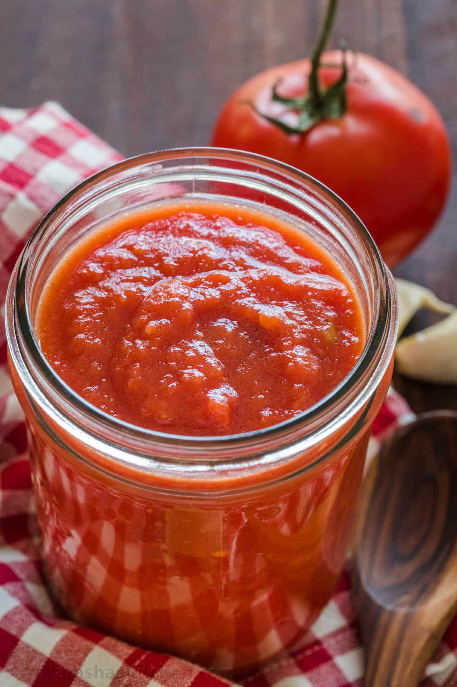

# Quick Pizza Sauce

Discovered [here](https://natashaskitchen.com/homemade-pizza-sauce/).

## Ingredients

| Ingredient | Quantity | Notes |
| ---------- | -------- | ----- |
| crushed tomatoes | 28 oz | |
| garlic cloves | 2 | pressed or finely grated |
| extra virgin olive oil | 1 tbsp | |
| fine sea salt | 1/2 tbsp | |
| dried oregano | 1/2 tsp | |

## Preparation

### Step 1
1. Combine all of your ingredients in the bowl of a food processor or blender.
2. Pulse together until well combined and blended.
3. Cover and refrigerate for the flavors to meld at least 3 hours.
4. Store in the refrigerator for 1 to 2 weeks.