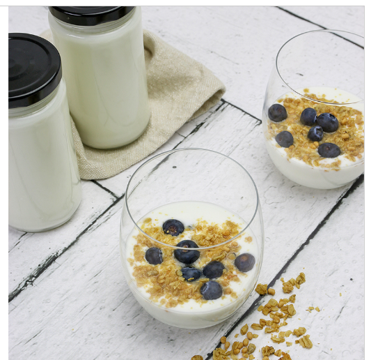

# Homemade Yogurt

Adapted from [here](https://www.excaliburdehydrator-recipes.com/recipe/homemade-yogurt/).

## Ingredients

| Ingredient | Quantity | Notes |
| ---------- | -------- | ----- |
| whole milk | 8 cups | |
| greek yogurt | 4 tbsp | |

## Preparation

### Step 1
1) Pour milk into saucepan, heat over medium until temperature reaches 185°F.
2) Remove from heat & Cool milk to 115°F. Immediately whisk in yogurt with active cultures. Make sure yogurt is mixed in well with milk.
3) Transfer mixture into glass jars, and close with lids.

### Step 2
1) Remove all trays from dehydrator and place jars inside.
2) Dehydrate at 110°F - 115°F for 7-10 hours. Do not stir or check yogurt during this time. You do not want to disturb the yogurt.
3) Once completed, place in refrigerator. Yogurt will thicken as it cools.

### Straining
At this point, the yogurt is edible. To make greek yogurt, it must be strained. 
1) Place yogurt in muslin cloth. Tie corners together to encapsulate.
1) PLace in strainer. Place strainer over mixing bowl.
1) Fill separate mixing bowl with water. Place water filled bowl on top of muslin bag.
1) Occasional drain excess liquid in bottom mixing bowl. 
1) After a time, the excess liquid from yogurt will be removed and the yogurt will become a firm texture. The process may be stopped at any point after desired consistency. 

## Notes
* This same process may be performed in an Instant Pot™. Refer to the instruction manual for directions as boiling is involved.
* Placing an [air temperature thermometer](https://www.amazon.com/Antonki-Hygrometer-Humidity-Thermometer-Greenhouse/dp/B07Z77FK4C/ref=sr_1_4) inside the dehyrdator will help you adjust the temperature according. Some dehydrators may fluctuate in temperature from their control mechanism.
* There are many other mechanisms for warming the mixture without specialty appliances. Some include:
    * placing in direct sunlight
    * warming by the light inside the oven
    * slightly warmed pot of water